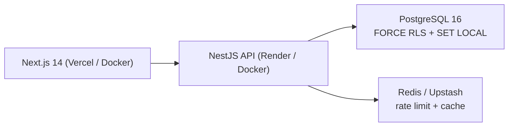

# Booking SaaS

Multi-tenant appointment booking: **NestJS** API and **Next.js** web app. PostgreSQL **Row Level Security** keeps tenants isolated. Availability uses the branch timezone (Luxon). Overlapping bookings are rejected by a database exclusion constraint.

## Demo

**Web:** https://booking-saas-web-two.vercel.app/login  
**API:** https://booking-saas-wrac.onrender.com/health

The first request after idle can take ~30–50 seconds (hosted API spins down). Retry once if login fails.

Password for all accounts: `ChangeMe123!`

| Role | Email | Login → Tenant |
|------|--------|----------------|
| Cliente (pide turno) | `cliente@tenant.dev` | Tenant A o B |
| Admin del local (acepta / rechaza) | `admin@tenant.dev` | Tenant A — Demo Clínica / Tenant B — Demo Salón |
| Staff | `ana@tenant-a.dev` / `carlos@tenant-b.dev` | Tenant A / Tenant B |
| Platform admin | `admin@bookingsaas.dev` | Super admin |

Walkthrough: login as **cliente** → Tenant A → **Sucursal Centro** → New booking → weekday slot. Then logout and login as **admin** of the same tenant: pending rows are at the top → Aceptar or Rechazar. Tenant B has a different catalog and timezone (`America/Mexico_City`).

## Architecture



Request path for tenant data: JWT → `TenantGuard` → `TenantContextInterceptor` opens a transaction, `SET LOCAL app.current_tenant_id` (or `app.is_super_admin` for platform admins), then repositories query through `PrismaService.client` (AsyncLocalStorage). The runtime DB role is `booking_app` (subject to RLS); `booking_admin` is migrations-only.

## Stack

NestJS · Prisma · PostgreSQL 16 (RLS, `booking_admin` / `booking_app`) · Redis · Next.js 14 · GitHub Actions (lint, unit, e2e, production images)

## Run locally

```bash
cp .env.example .env
docker compose up --build
```

Web: http://localhost:3000 · API: http://localhost:3001/health

Use the same demo emails and password as above. After a volume wipe (`docker compose down -v`), run migrations as `booking_admin` then seed before logging in with an old JWT.

## Repository

```
apps/api    NestJS
apps/web    Next.js
docker/     Postgres init (btree_gist, app role)
docs/       Design notes (optional reading)
```

Production Dockerfiles: `apps/api/Dockerfile.prod`, `apps/web/Dockerfile.prod`.  
Intended AWS layout (not deployed): [docs/aws-target.md](docs/aws-target.md).  
Phase checklists and engineering notes: [docs/engineering-log.md](docs/engineering-log.md).  
Hosted demo runbook: [docs/deploy-demo.md](docs/deploy-demo.md).
